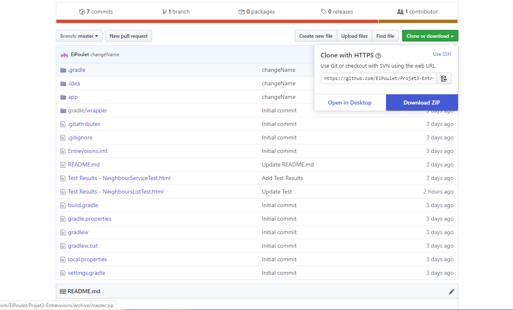
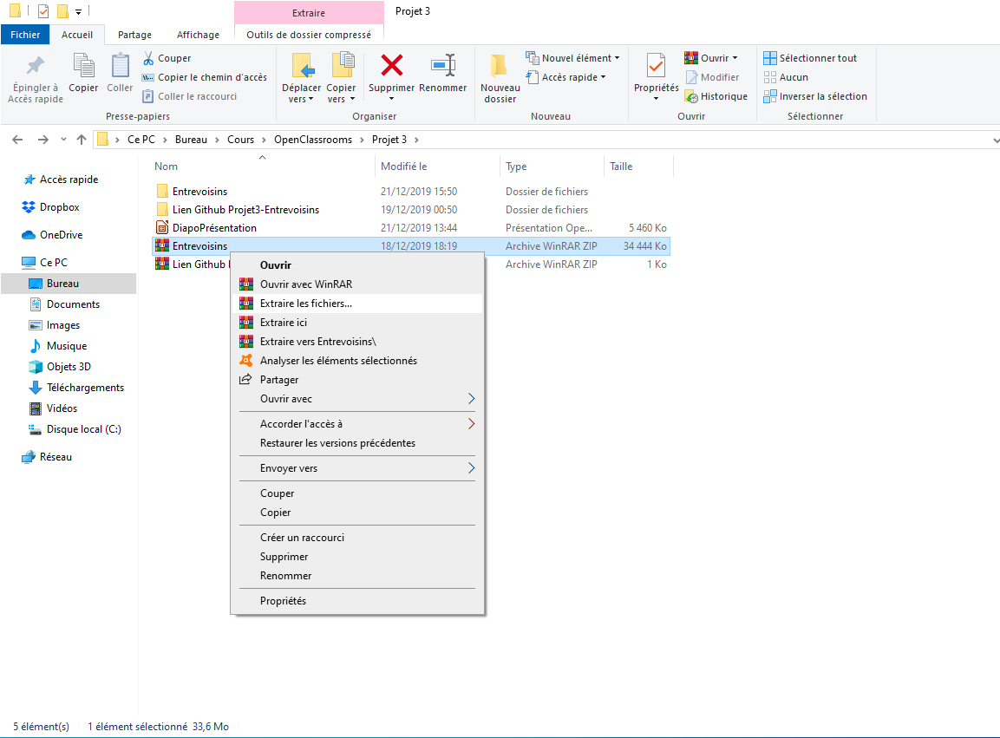
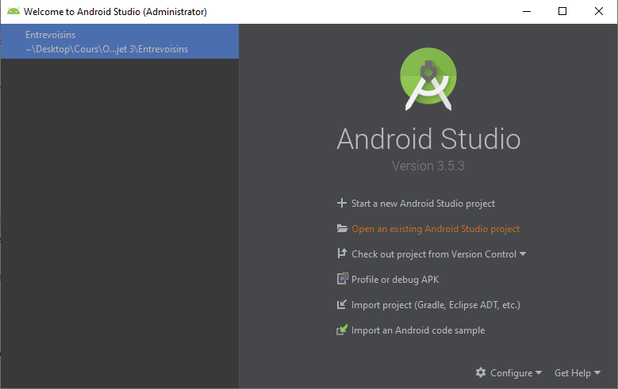
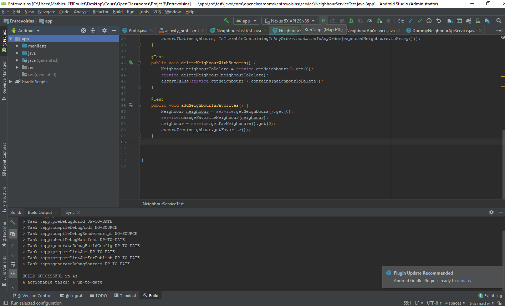

# OpenClassrooms

Ce dépôt contient une mini-application pour le P3 du parcours **Développement Application Android**.

Suivre les instructions pour installer et tester l'application

**Etape 1:**
Télécharger l'application sur le lien Github **https://github.com/ElPoulet/Projet3-Entrevoisins**

**Etape 2:**
Stocker et déziper le fichier dans un dossier

**Etape 3:**
Ouvrir Android Studio et ouvrir le projet correspondant

**Etape 4:**
Lancer l'application à l'aide de la flêche verte en haut de la barre de menu

